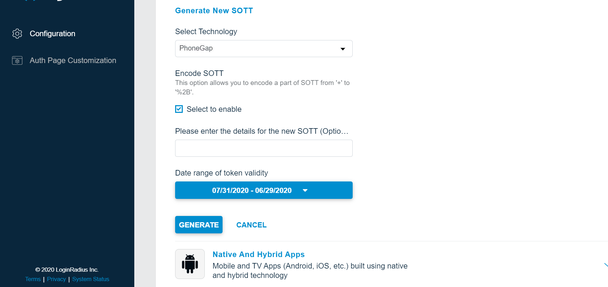

This guide covers the various authentication types and features supported by the LoginRadius Identity Platform’s developer plan.


> **Disclaimer** <br/><br/>  This library is meant to help you with a quick implementation of the LoginRadius platform and also to serve as a reference point for the LoginRadius API. Keep in mind that it is an open source library, which means you are free to download and customize the library functions based on your specific application needs.

## Prerequisites

You need to slightly configure your LoginRadius user account with the following changes.
1. Under Identity Providers, add an `apikey` parameter to the default links in the Verification Email and Forgot Password Email Templates.

Verification Email Template: "#Url#?vtype=emailverification&vtoken=#GUID#&apikey="

Forgot Password Email Template: "#Url#?vtype=reset&vtoken=#GUID#&apikey="

<div style="text-align:center">
  
</div>


2. Generate SOTT You need to pass the SOTT value at the time of registration in PhoneGap library and you can generate this by [dashboard](https://dashboard.loginradius.com/dashboard).

Open dashboard, Click on *Configure Your Application* and open *Mobile SOTT* . now set the time according to the requirement and generate SOTT.

<div style="text-align:center">
  
</div>


## Installation

1. To download the SDK, please go to the LoginRadius Github repository from [here](https://github.com/LoginRadius/phonegap-sdk).
2. Download a copy of `LoginRadiusPhoneGapSDK.js` from the PhoneGap SDK and include the following scripts in your project
```
<script src="js/LoginRadiusPhoneGapSDK.js"></script>
<script src="https://auth.lrcontent.com/v2/LoginRadiusV2.js"></script>

```
3. Follow Apache Cordova's documentation to install the [Apache Cordova InAppBrowser](https://cordova.apache.org/docs/en/9.x/reference/cordova-plugin-inappbrowser/index.html) in your current project
```
cordova plugin add cordova-plugin-inappbrowser
```
> **Note**: If you're using Cordova 4.0.0 or higher, you must install the Apache Cordova Whitelist in order to make network requests. Please follow Cordova's installation documentation.

```
cordova plugin add cordova-plugin-whitelist
```
4. Initialize a LoginRadius object before `onLoad`
```
var commonOptions = {};
commonOptions.apiKey = "<YOUR_LOGINRADIUS_APIKEY>";
commonOptions.appName = "<YOUR_LOGINRADIUS_APPNAME>";
commonOptions.hashTemplate = true;
commonOptions.accessTokenResponse = true;
commonOptions.phoneLogin = false;
commonOptions.sott ="<YOUR_GENERATED_SOTT>";
commonOptions.verificationUrl = "https://auth.lrcontent.com/mobile/verification/index.html";
commonOptions.callbackUrl = "<YOUR_PHONEGAP_APP_NAME>://";
commonOptions.isMobile =true;
commonOptions.formValidationMessage=true;
commonOptions.instantLinkLogin = true;
commonOptions.smartLoginPingCount = <any number>; //default is 100 times
commonOptions.smartLoginPingInterval = <any number>; //default is 5 second
commonOptions.smartLoginEmailTemplate = <Email template>
commonOptions.smartLoginRedirectUrl = <Redirect Url>
commonOptions.projectionFields = {"login":["Profile","access_token"]};
commonOptions.usernameLogin = true;
var LRObject= new LoginRadiusV2(commonOptions);
```

You can find your PhoneGap app name in your `config.xml` file as the "Name" field.


For Single Page Apps, initialize the LoginRadius callback object before `onDeviceReady`. For Multipage Apps, initialize the LoginRadius callback object in `onDeviceReady`

```
var options = {};

//Initialize the function that will handle the responses from the Loginradius APIs.
options.callback = function(params) {
    //Handle the actions for: sociallogin, login, registration, and forgotpassword
    switch (params.action) {
        //Social login returns an accesstoken which can be used to pull user details for APIs calls.
        case "sociallogin":
            //handle Social functionality
            break;
            //Login returns an accesstoken which can be used to pull user details for APIs calls.
        case "login":
            //handle Email and Password Functionality
            break;
            //Registration returns an email message and status which you can use to display messages to your user.
        case "registration":
            //Handle successful registration messaging
            break;
            //Forgot password returns an email message and status which you can use to display messages to your user.
        case "forgotpassword":
            //Handle Forgot password messaging
            break;
        default:
            alert('action not defined');
            break;
    }
};
//Initialize the LoginRadius PhoneGap SDK object
$LR.init(options);
```

The above initialization requires an `options` object with the following parameters

|Name|Description|Required|
|---|---|---|
|apiKey|Your LoginRadius API Key|Yes|
|appName|Your LoginRadius App Name|Yes|
|sott|	A Secure One-Time Token	|Yes|
|verificationUrl|	|A dynamic URL for email verification <br/> Default: https://auth.lrcontent.com/mobile/verification/index.html	|Yes|
|forgotPasswordUrl|	A dynamic URL for resetting a password	|Yes|
|formValidationMessage|	true: Shows form validation message just below the form elements <br/> false: No form validation message	|Yes|
|callbackUrl|	Your PhoneGap app name. For example: ExampleApp://. Whitelist your callbackUrl in the LoginRadius Admin Console.	|Yes|
|passwordLength|	Your password length. For example: {min : 10, max :32}	|Recommend|


5. Initialize the LoginRadius PhoneGap SDK object:

```
$LR.init(options);
```

## Actions
The object passed to the callback function contains useful fields including the action triggering the callback.


|Action Name| Contents|
|-------------|-----------------|
| login	| token: The LoginRadius Access Token <br/> status: Boolean indicating whether login was successful |
| sociallogin |	token: The LoginRadius Access Token <br/> status: Boolean indicating whether login was successful |
| registration |	email: The email used during registration. <br/> status: Boolean indicating whether registration was successful |
| forgotpassword	| email: The email used during password reset. <br/> status: Boolean indicating whether the password was reset successfully |


### Activation
Finally, setup elements to trigger the functions that will direct your users to the relevant IDX interfaces.

#### Login

Trigger: `$LR.util.lrLogin();`

Description: Triggers the Login interface and returns a "login" action to the callback function.

To render the Traditional Login interface, add the following:

```
<div id="login-container"></div>
```

For Social and Traditional Login interfaces on the same page, add the following:

```
<div id="interfacecontainerdiv" class="interfacecontainerdiv" style="text-align: center;"></div>
<div id="sociallogin-container"></div>
<script type="text/html" id="loginradiuscustom_tmpl">
<a class="lr-provider-label" href="javascript:void(0)" onclick="return <#=ObjectName#>.util.openWindow('<#= Endpoint #>');" title="<#= Name #>" alt="Sign in with <#=Name#>">
<#=Name#>
</a>
</script>
<div id="login-container"></div>
```

#### Social Login


